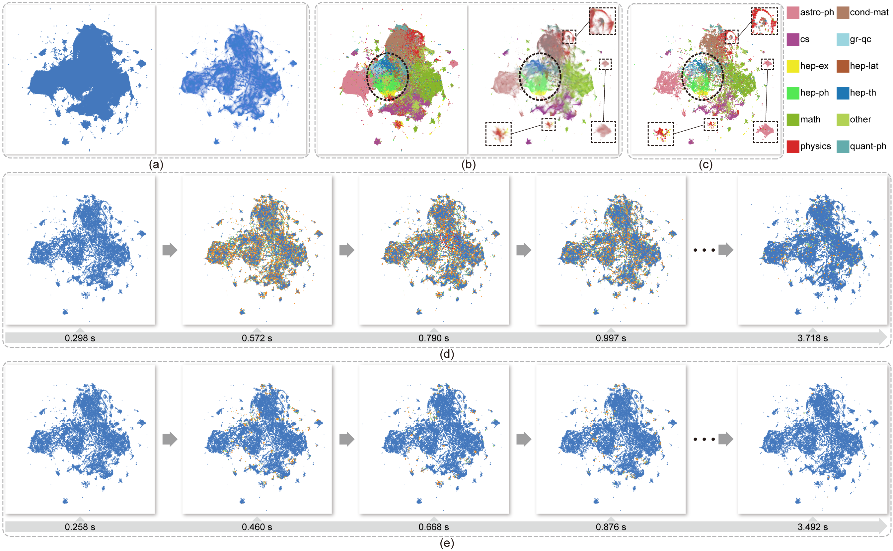
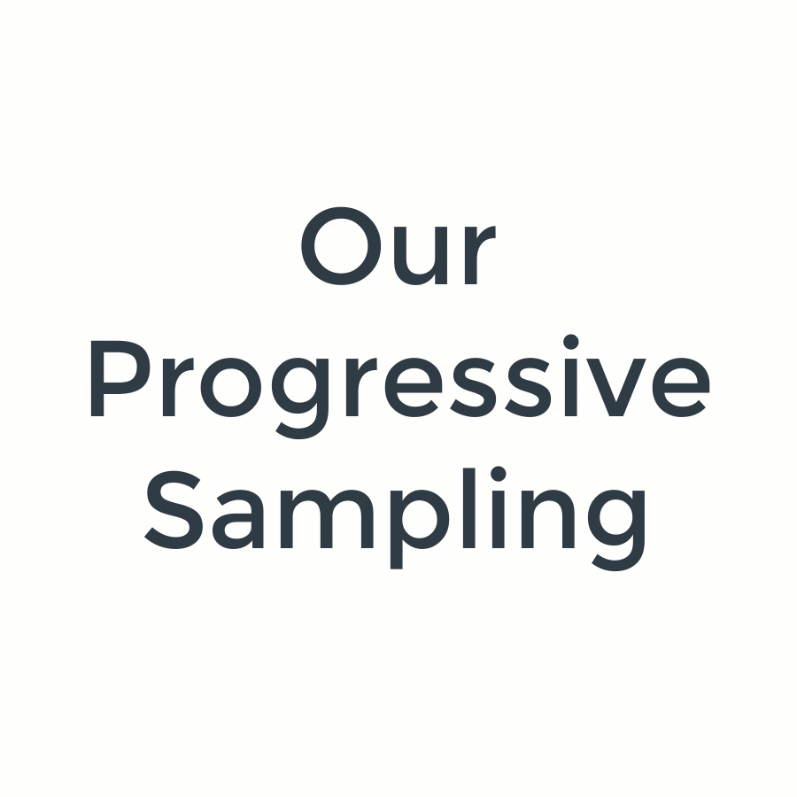

# Pyramid-based Scatterplots Sampling for Progressive Visualization

This is the interactive demo application for the "Pyramid-based Scatterplots Sampling for Progressive and Streaming Data Visualization" paper.

You can adjust the parameters in the left control panel to decide how many outliers are kept (density threshold & outlier weight), which level of details you want to observe (stop level), and the temporal coherence between successive frames (ratio threshold).

Click the "Select" button to load a dataset and click the "Start" button to start the progressive sampling.
If you want to inspect a specific frame after the sampling process, please first set the frame ID in the and then click the "Show" button.

### Results

Progressive sampling on [the Hertzsprung-Russell diagram](https://en.wikipedia.org/wiki/Hertzsprung%E2%80%93Russell_diagram) based on a subset of [Gaia Data Release 2](https://doi.org/10.1051/0004-6361/201833051) that contains 1,322,033 stars.
(a) the scatterplot of the input data (top) and the density map (bottom), each pair of the overlaid red and green lines corresponds to an unresolved binary system of two identical star;
(b,c) the results of the intermediate frames generated by reservoir sampling (b) and our method (c), each frame containing 100,000 stars. Among them, the patterns in the purple and yellow boxes have similar structures as the ones at the bottom of (a), while the outliers in the red circle are better preserved. In contrast, all these structures cannot be clearly revealed in (b).

#### Animation Comparison

    
    

### Abstract
We present a pyramid-based scatterplot sampling technique to avoid overplotting and enable progressive and streaming visualization of large data.
Our technique is based on a multiresolution pyramid-based decomposition of the underlying density map and makes use of the density values in the pyramid to guide the sampling at each scale for preserving the relative data densities and outliers.
Also, we have adapted it to deliver _progressive_ and _streaming data_ visualization by processing the data in chunks and updating the scatterplot areas with visible changes in the density map.
A quantitative evaluation shows that our approach generates stable and faithful progressive samples that are comparable to the state-of-the-art method in preserving relative densities and superior to it in keeping outliers and stability when switching frames.
We present two case studies that demonstrate the effectiveness of our approach for exploring large data.

### Dependencies
The following libraries are required:
* Qt5Core
* Qt5GUI
* Qt5Widgets
* Qt5Svg
* Qt5PrintSupport
